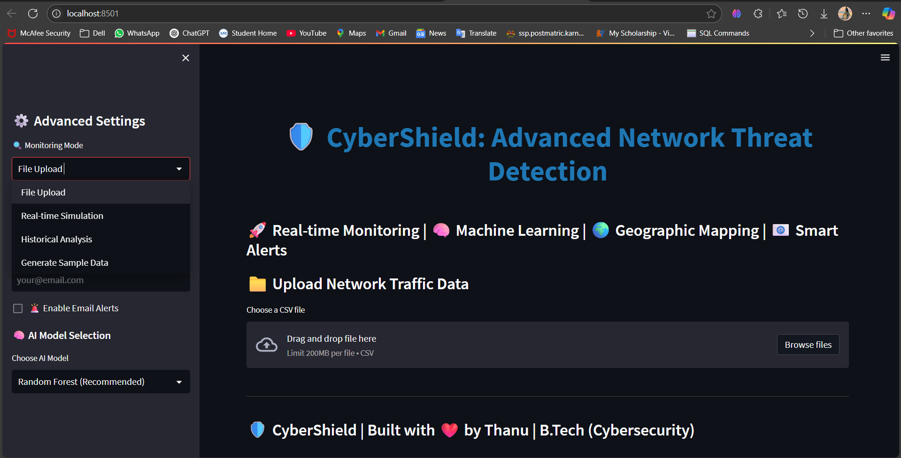
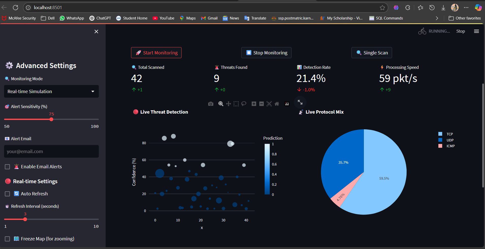

# AI-Powered Real-Time Network Threat Detection System

## 📌 Project Summary
This project is a machine learning-based threat detection system built to identify malicious or suspicious activity within network traffic logs. It provides an interactive dashboard for monitoring threats and analyzing traffic, with support for real-time packet analysis using Python-based sniffers and ML inference pipelines.

## 🎯 Key Features
- **Real-time Network Monitoring**: Capture and analyze network packets as they occur
- **Machine Learning Detection**: Identify suspicious traffic using trained ML models
- **Interactive Dashboard**: Visualize threats and traffic patterns in a user-friendly interface
- **Configurable Alerts**: Adjust sensitivity thresholds to control alert frequency
- **Batch Analysis**: Upload and analyze network log files (CSV format)
- **Command-line Interface**: Run monitoring without the dashboard for headless operation

## 📸 Dashboard Preview

### 🧠 Main Dashboard View:


### 🚦 Real-time Monitoring View:



## 🛠️ Installation

### Prerequisites
- Python 3.8 or higher
- Administrator/root privileges (required for packet capture)

### Setup
1. Clone the repository:
   ```
   git clone https://github.com/yourusername/ai-threat-detection.git
   cd ai-threat-detection
   ```

2. Install dependencies:
   ```
   pip install -r requirements.txt
   ```

3. Ensure you have the trained model files in the `app/` directory:
   - `random_forest_model.pkl`
   - `gradient_boost_model.pkl`
   - `model.pkl` (optional)
   
   If not, train the models:
   ```
   python data/train_model.py
   ```

## 🚀 Usage

### Streamlit Dashboard
Run the Streamlit dashboard for interactive analysis:

```
streamlit run cybershield_dashboard.py
```

Or on Windows, simply double-click:
```
Start_CyberShield.bat
```

The dashboard provides multiple modes:
1. **File Upload Analysis**: Upload network log CSV files for batch analysis
2. **Real-time Simulation**: Simulate real-time network traffic monitoring
3. **Historical Analysis**: Analyze historical network traffic trends
4. **Generate Sample Data**: Create custom network traffic datasets for testing

### Command-line Monitoring
For headless operation or server environments, use the command-line monitor:

```
python run_monitor.py --interface eth0 --threshold 90 --output threats.csv --verbose
```

Options:
- `--interface` or `-i`: Network interface to monitor (default: all interfaces)
- `--threshold` or `-t`: Confidence threshold for alerts (default: 85.0)
- `--output` or `-o`: Output CSV file for detected threats (default: None)
- `--verbose` or `-v`: Print detailed information about each packet

## 📊 Dashboard Features

### File Upload Analysis
- Upload network log CSV files
- View raw data and preprocessed results
- Visualize threat distribution and confidence levels
- Filter results based on confidence threshold

### Real-time Monitoring
- Select network interface to monitor
- Start/stop monitoring with a single click
- View live threat detection results
- Auto-refreshing dashboard with real-time statistics
- Configurable alert sensitivity

## 🧠 Machine Learning Model
The system uses a Random Forest classifier trained on network traffic features to identify potential threats. The model analyzes various packet attributes including:

- IP addresses and ports
- Protocol information
- Packet sizes and timing
- TCP flags and window sizes
- Connection patterns

## 📁 Project Structure
```
ai-threat-detection/
├── app/
│   ├── random_forest_model.pkl  # Random Forest ML model
│   ├── gradient_boost_model.pkl # Gradient Boosting ML model
│   └── model.pkl               # Best performing ML model
├── data/
│   ├── data_preprocessing.py  # Data preprocessing functions
│   ├── predict.py        # Prediction functions
│   └── train_model.py    # Model training script
├── src/
│   ├── packet_sniffer.py      # Network packet capture and processing
│   └── real_time_dashboard.py # Real-time dashboard components
├── cybershield_dashboard.py # Advanced Streamlit dashboard application
├── Start_CyberShield.bat # Windows launcher script
├── run_monitor.py        # Command-line monitoring tool
└── requirements.txt      # Project dependencies
```

## ⚠️ Important Notes
- Real-time packet capture requires administrator/root privileges
- The system is designed for educational and defensive security purposes
- Always obtain proper authorization before monitoring network traffic
- Performance may vary based on network traffic volume and system resources

## 👨‍💻 Author
Built with 💡 by Thanu | Final Year B.Tech (Cybersecurity)

## 📄 License
This project is licensed under the MIT License - see the LICENSE file for details.
